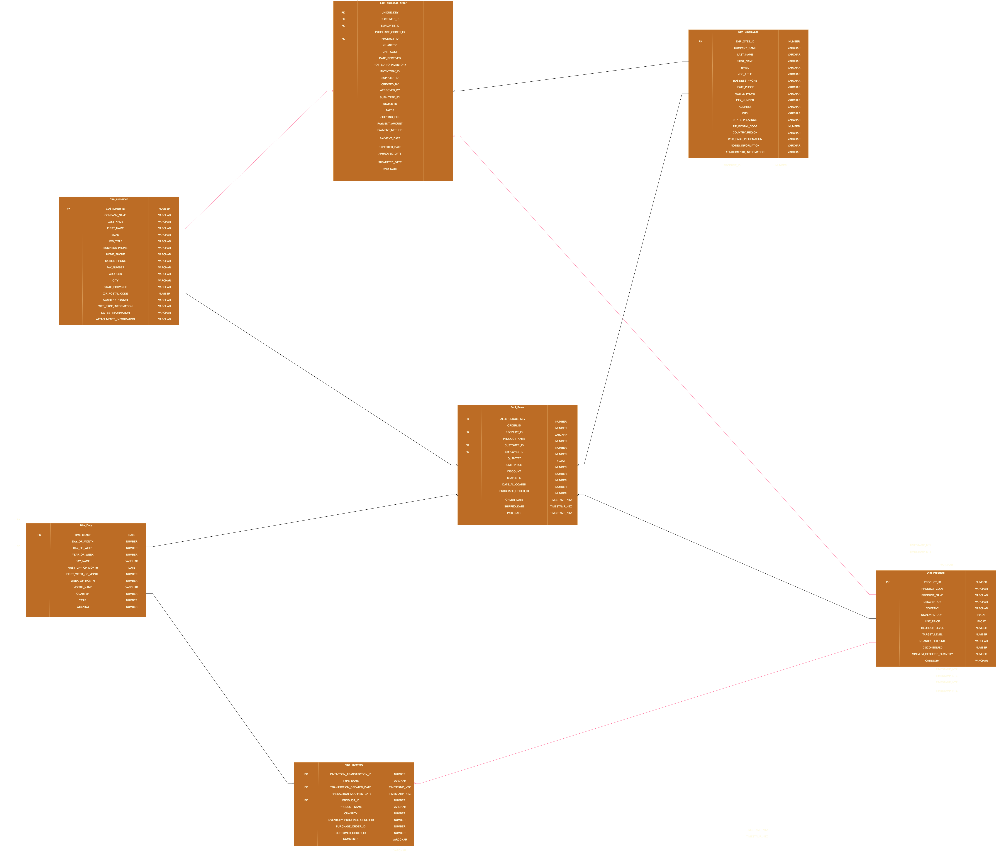

# Description

## Architecture Design

This project is built based on the Northwind dataset and represents Kimball's approach to creating a replica of the Northwind Data Warehouse.


## Technique

- SQL
- Lib : dbt-ultils,dbt-expectations
- Install virtual environment

  ```bash
     pip3 -m venv northwind_project_env
     pip3 install dbt-core dbt-snowflake
  ```

  - Database : Snowflake
  - Environment : dbt-core
  - editor : Visual Studio Code

    - Init warehouse , database, user and role for transformation

    ```bash
      USE ROLE ACCOUNTADMIN
      CREATE ROLE IF NOT EXISTS TRANSFORM
      GRANT ROLE TRANSFORM TO ROLE ACCOUNTADMIN
      CREATE WAREHOUSE IF NOT EXISTS NORTHWIND_WH;


      CREATE USER IF NOT EXISTS ethan
      PASSWORD = '123456'
      LOGIN_NAME = 'ethan'
      DEFAULT_WAREHOUSE = 'NORTHWIND_WH'
      DEFAULT_ROLE = TRANSFORM
      DEFAULT_NAMESPACE = 'NORTHWIND'

      GRANT ROLE TRANSFORM TO USER ethan
      CREATE DATABASE IF NOT EXISTS NORTHWIND
      DROP SCHEMA IF EXISTS NORTHWIND.RAW
      CREATE SCHEMA IF NOT EXISTS NORTHWIND.RAW


      GRANT ALL ON WAREHOUSE NORTHWIND_WH TO ROLE TRANSFORM
      GRANT ALL ON DATABASE NORTHWIND to ROLE TRANSFORM
      GRANT ALL ON ALL SCHEMAS IN DATABASE NORTHWIND to ROLE TRANSFORM
      GRANT ALL ON FUTURE SCHEMAS IN DATABASE NORTHWIND to ROLE TRANSFORM
      GRANT ALL ON ALL TABLES IN SCHEMA NORTHWIND.RAW to ROLE TRANSFORM
      GRANT ALL ON FUTURE TABLES IN SCHEMA NORTHWIND.RAW to ROLE TRANSFORM

    ```

## Start the Pipeline

- Activate the Python venv (**_northwind_dbt_env_**)

```bash
   source northwind_dbt_env/bin/activate
```

- Init dbt project
  ```bash
     dbt init
  ```
- Create `packages.yml`,install packages
  ```bash
      dbt deps
  ```
- Import dataset to seed in csv format
  ```bash
     dbt seed
  ```
- Structure `models` folder:

  ```bash
   models/
  ├── mart/
  │   ├── dimension/
  │   └── fact/
  ├── obt/
  │   ├── _obt_docs.md
  │   ├── _obt_properties.yaml
  │   ├── customer_reporting.sql
  │   ├── product_inventory.sql
  │   └── sales_overview.sql
  ├── staging/
    └── northwind/
        ├── customer/
        │   └── northwind_stg__customer.sql
        ├── employees/
        │   ├── northwind_stg__employee_privileges.sql
        │   └── northwind_stg__employees.sql
        ├── etcera/
        │   ├── northwind_stg__invoices.sql
        │   ├── northwind_stg__privileges.sql
        │   ├── northwind_stg__sales_reports.sql
        │   └── northwind_stg__suppliers.sql
        ├── inventory/
        │   ├── northwind_stg__inventory_transaction_types.sql
        │   └── northwind_stg__inventory_transactions.sql
        ├── orders/
        │   ├── northwind_stg__order_details_status.sql
        │   ├── northwind_stg__order_details.sql
        │   ├── northwind_stg__order_status.sql
        │   ├── northwind_stg__orders_tax_status.sql
        │   └── northwind_stg__orders.sql
        ├── products/
        │   └── northwind_stg__products.sql
        ├── purchase_order/
        │   ├── northwind_stg__purchase_order_details.sql
        │   ├── northwind_stg__purchase_order_status.sql
        │   └── northwind_stg__purchase_orders.sql
        ├── _northwind__sources.yml
        ├── _staging_properties.yaml
        └── _northwind__docs.md

  ```

### Key Design Aspects of the Data Warehouse:

1. **Sales Overview**

   - Provides overall sales reports to better understand customer behavior: what is being sold, what sells the most, where, and what sells the least.
   - The goal is to gain a general overview of business performance.

2. **Product Inventory**

   - Helps understand current inventory levels and improve stock management.
   - Identifies suppliers, tracks purchasing trends, and analyzes stock data.
   - This enables better stock control and facilitates negotiations with suppliers for better deals.

3. **Customer Reporting**
   - Allows customers to track their purchase orders, including how much they are buying and when.
   - Empowers customers to make data-driven decisions and integrate their sales data for better insights.

### Fact and Dimension Representation:

### The Fact-Dimension model can be represented in the physical layer as shown below:

### Packages used in in project:

- dbt-utils
- dbt-expectations


